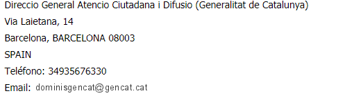
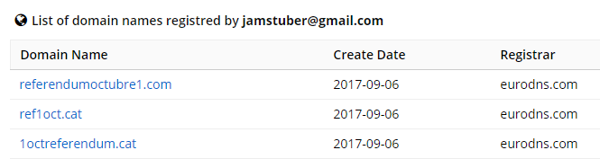
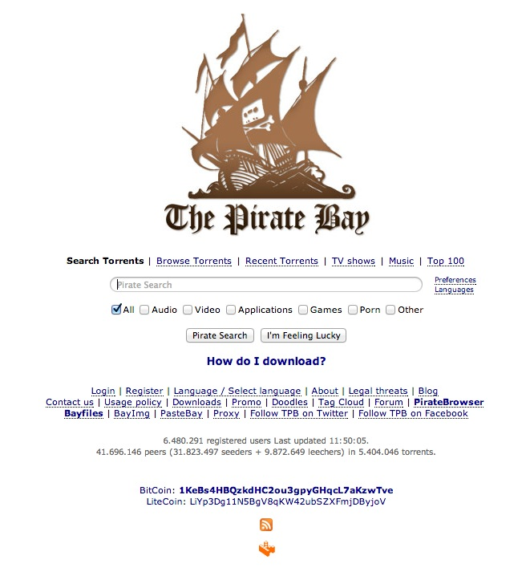
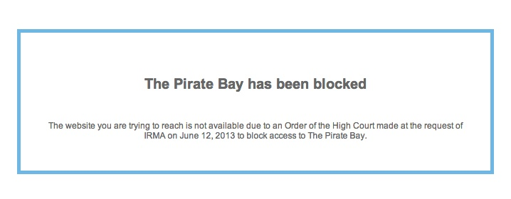
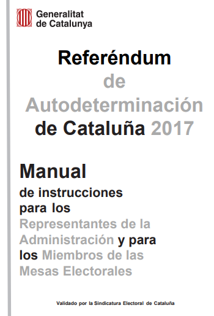

[volver](./)

# Contenidos

* [Bloqueos DNS y censura en la red](#bloqueos-dns-y-censura-en-la-red)
* [Respuesta del Govern](#respuesta-del-govern )
* [Fundació puntCAT: El organismo que regula los nombres de dominio](#fundació-puntcat-el-organismo-que-regula-los-nombres-de-dominio)
* [Servidores DNS](#servidores-dns)
* [Precedentes en el mundo](#precedentes-en-el-mundo)
	* [Turquía](#turquía)
	* [Pirate Bay](#pirate-bay)
* [Enlaces externos](#enlaces-externos)

# Bloqueos DNS y censura en la red

[subir a contenidos](#contenidos)

La primera web del referéndum [referendum.cat](http://referendum.cat/) (dirección IP de red 2.22.126.197) fue cerrada por orden judicial el 13 de Septiembre, sólo seis días después de su publicación, sólo hay que ver el aspecto que sigue ofreciendo hoy en día (por cierto, necesitan un diseñador Web de forma urgente):

Esta Web tenía como propósito informar sobre la consulta, la orden de bloqueo de la Web proviene del juzgado de instrucción número 13 a petición de la GC (parece que la empresa que aloja la Web es [10dencehispahard S.L. (CDmon.com)](https://www.cdmon.com/es/)) y Akamai Technologies.

**Como era de predecir (para todxs excepto lxs informáticxs del gobierno de Madrid parece) surgen clones de la Web original**, la medida judicial solo alimenta una respuesta más virulenta casi imposible de detener ya. Es imposible ponerle puertas al campo. 

Inmediatamente se hicieron  públicas **dos direcciones alternativas**.

**[ref1oct.eu](https://www.ref1oct.eu/)**  (IP 35.201.78.139) con dominio de la unión europea (EU=European Union) esta registrada por la empresa [EuroDNS S.A](https://www.eurodns.com/) con sede en Luxemburgo ([Google maps](https://goo.gl/maps/kKnoa9WJq4R2)). Actualmente esta Web esta inaccesible.  	 

Una consulta [Whois](https://whois.net/) muestra algunos datos sobre la empresa que registra el nombre, [Xabier Buck](https://www.linkedin.com/in/xavierbuck/) solo es un directivo de la empresa EuroDNS que ofrece servicios de alojamiento a miles de otras Webs.  

La segunda Web espejo es **[ref1oct.cat](https://www.ref1oct.cat/)** (IP 2.20.44.196) y se encuentra intervenida por autoridad judicial como la original. Se pueden obtener más datos del registrante del nombre ref1oct.cat realizando una [consulta Whois en fundacio.cat](http://fundacio.cat/es/whois).

Parece que el señor jamestuber@gmail.com de GB aparece como el nombre del registrante. 

**Se presume que desde Madrid se ordena a ISPs (Internet Service Provider o proveedores de acceso a Internet) que bloqueen el acceso a sitios específicos, sospechamos que se produce un bloqueos DNS.**

Otras Webs clonadas:

* [referendum1oct.cat](http://referendum1oct.cat/) Otra de las Webs clonadas.

# Respuesta del Govern 

[subir a contenidos](#contenidos)

Podemos decir que en este punto se internacionaliza la cuestión y pasa de ser un asunto interno de un país a ser una cuestión más allá.

Carta del gobierno de Cataluña (24/09/2017), escrita por [Jordi Puigneró](https://ca.wikipedia.org/wiki/Jordi_Puigner%C3%B3_i_Ferrer) - [@jordiPuignero](https://twitter.com/jordipuignero?lang=es) **presidente del CTTI** (Centro de Telecomunicaciones y Tecnologías de la Información) dirigida al Vicepresidente y Comisario europeo de Mercado Único Digital (Digital Single Market) [Andrus Ansip](https://es.wikipedia.org/wiki/Andrus_Ansip) [[PDF](docs/d954e7d5-8006-40d3-bdfd-7f66d75bcdf7.pdf)].

En la misiva el gobierno Catalán denuncia los abusos y la censura por parte del estado Español. Concretamente destaca varios artículos de la regulación de la UE que regulan el acceso libre a Internet. 

Al final de la carta reseña dos medidas desproporcionadas del estado:

* La orden judicial enviada a la fundación **puntCAT** solicitando la censura de cualquier Web relacionada con el referéndum.
* La orden enviada a operadores de telecomunicaciones (**ISPs**) pidiendo bloquear los servidores proxy 

# Fundació punt CAT: El organismo que regula los nombres de dominio

[subir a contenidos](#contenidos)

[Fundació puntCAT](http://fundacio.cat/) ([@puntcat](https://twitter.com/puntcat)) es el organismo que de alguna manera regula los nombres de las Webs acabadas con .cat como la citada arriba referendum.cat. Actualmente tiene registrados 112.984 sitios Web con esta terminación ([servidores DNS púbicos](http://servidordenoms.cat/)). 

	puntCAT solo regula los dominios .cat pero tiene un hermano mayor que los regula a nivel mundial y se llama [ICANN](https://www.icann.org/es) (La Corporación de Internet para la Asignación de Nombres y Números con origen en EEUU). puntCAT escribe una misiva al ICANN el 17 de Septiembre [[PDF]](https://www.icann.org/en/system/files/correspondence/lineros-to-marby-17sep17-en.pdf) dirigida a [Göran Marby](https://www.icann.org/profiles/goran-marby) (presidente y CEO de ICANN, hay es nada) informando que el 15 de Septiembre las autoridades judiciales Españolas ordenan bloquear cualquier Web .cat que contenga cualquier información referente al 1 de Octubre. Tachan las prácticas de censura y ataque a la libertad de expresión, la carta está firmada a su vez por [Eduard Martin Lineros](http://fundacio.cat/es/noticias/eduard-martin-lineros-nuevo-director-general-de-la-fundacio-puntcat) CEO y fundador de puntCAT.

# Servidores DNS

[subir a contenidos](#contenidos)

De manera algo sencilla, cuando introducimos [referendum.cat](http://referendum.cat/) sólo es un nombre para facilitarnos a los simples mortales recordar un sitio Web, realmente detrás de ese nombre existe una máquina identificada con un número único en Internet (simplificando mucho), como una especie de matricula, en este caso referendum.cat se traduce como “92.122.241.124” Todo ese proceso de conversión de nombre a esa serie de bloques de números separados por puntos lo hacen otras máquinas en Internet llamadas servidores **DNS** (**D**omain **N**ame **S**ystem o Sistema de Nombres de Dominio).

Es muy habitual que nuestro **ISP** (**I**nternet **S**ervice **P**rovider o Proveedor de Servicios de Internet) nos proporcione esos números de los servidores **DNS** que se suelen configurar en nuestra computadora de casa.

# Precedentes en el mundo

[subir a contenidos](#contenidos)

## Gobiernos

[subir a contenidos](#contenidos)

Tristemente la medida no es original y es algo muy predecible por otro lado. En el 2014 el **gobierno Turco trata de silenciar la oposición política y toma la misma medida aplicando el bloqueo DNS.**

Esta medida no es extremadamente difícil de sortear, los internautas turcos cambian la configuración de sus ordenadores para usar la dirección IP de los sevidores públicos de Google (8.8.8.8 y 8.8.4.4), ahora cuando introducen la dirección de [Twitter](http://twitter.com) o de Youtube por ejemplo la resolución del nombre en números lo hace otro DNS (no solo Google presta esta servicio de DNS, ver enlace).

Uno de los objetivos predilectos de estos estados suelen ser las redes sociales. Turquía no es el primero ni el último en restringir el uso de las redes sociales y las plataformas de internet. La lista es muy larga e incluye paises como: China, Vietnam, Turquía, Iran, Corea del Norte y ahora España. 

El gobierno Chino es conocido por bloquear sitios de noticias o páginas que contengan información sobre el movimiento de liberación del Tibet entre otras muchas.

## Pirate Bay

[subir a contenidos](#contenidos)

En otros ámbitos también se ha aplicado en Webs de descarga de torrents como Pirate Bay.

Para sortear este bloqueo la Web estuvo saltando de un dominio a otro (.gy = Guyana, .pe = Peru,...)

# Anexos

[subir a contenidos](#contenidos)

Manual mesas electorales en PDF: [1505386392-mme_esp.pdf](docs/1505386392-mme_esp.pdf)

## Enlaces externos

[subir a contenidos](#contenidos)

### Censura CAT

* [El TSJC pide a empresas documentación sobre la gestión de los ordenadores del 9N](http://www.catalunyapress.es/texto-diario/mostrar/371930/tsjc-pide-empresas-documentacion-sobre-gestion-ordenadores-9n)
* [El Govern abre otra web del referéndum tras el cierre ordenado por un juez](http://www.elmundo.es/cataluna/2017/09/13/59b96a0d22601da7268b45f8.html).
* [Correos ordena no entregar ninguna carta referente al 1-O](http://www.larazon.es/espana/correos-ordena-no-entregar-ninguna-carta-referente-al-1-o-HF15983631?sky=Sky-Septiembre-2017#Ttt1FVU3Frj0kCjH).
* [“Catalan government opens new referendum website after original is shut down by Spain”](http://www.catalannews.com/politics/item/catalan-government-opens-new-referendum-website-after-original-is-shut-down-by-spain) (catalannews.com – 14/09/2017).
* [“Un juez cierra la web de la Generalitat sobre el referéndum de Cataluña”](https://elpais.com/ccaa/2017/09/13/catalunya/1505324341_709098.html)(elpais.com – 14/09/2017).
* [“Spanish govt slammed over bizarre Catalan .cat internet registry cop raid”](https://www.theregister.co.uk/2017/09/23/spanish_government_criticized_over_catalan_internet_registry_raid/) (theregister.co.uk – 23/09/2017).
* [“¡Dios mío! Spain blocks DNS to hush Catalonian independence vote sites”](https://www.theregister.co.uk/2017/09/27/spain_expands_dns_blocking_over_catalan_independence_vote/) (theregister.co.uk – 27/09/2017)
* ["El Govern trasllada al Vicepresident de la Comissió Europea un escrit denunciant els abusos i la censura de l'Estat en matèria d'accés a Internet"](http://premsa.gencat.cat/pres_fsvp/AppJava/notapremsavw/303353/ca/govern-trasllada-vicepresident-comissio-europea-escrit-denunciant-abusos-censura-lestat-materia-dacces-internet.do) (premsa.gencat.cat - 24/09/2017)
* ["No Justification for Spanish Internet Censorship During Catalonian Referendum"](https://www.eff.org/es/deeplinks/2017/10/no-justification-spanish-internet-censorship-during-catalonian-referendum) (Electronic Frontier Foundation - 02/10/2017).
* ["La Guardia Civil bloquea más de 140 webs de apoyo al 1-O por orden del TSJCat"](http://www.publico.es/politica/guardia-civil-bloquea-140-webs-apoyo-1-orden-tsjcat.html).

### Pirate Bay

* ["Pirate Bay’s Domain Hopping Fails"](https://www.internetnews.me/2013/12/18/pirate-bays-domain-hopping-fails/).
* ["Ireland’s High Court orders six ISPs to block access to The Pirate Bay"](https://www.siliconrepublic.com/comms/irelands-high-court-orders-six-isps-to-block-access-to-the-pirate-bay).
* ["Block Pirate Bay in 72 Hours, Spanish Court Tells ISPs"](https://torrentfreak.com/block-pirate-bay-in-72-hours-spanish-court-tells-isps-150327/): Infamous torrent site The Pirate Bay has a new European block to contend with after a judge in Spain handed down a ruling against the site today. Local ISPs now have 72 hours in which to block the site, the first instruction of its type under the country's so-called Sinde Law.

### Censura gubernamental en otros países

* [It Took Us Less Than Five Seconds To Get Past The Government's Anti-Piracy Site Blocks](https://www.gizmodo.com.au/2017/02/it-took-us-less-than-five-seconds-to-get-past-the-governments-anti-piracy-site-blocks/)
* [How To Bypass ISP Blocking Of The Pirate Bay And Other Torrent Sites For Free](https://www.lifehacker.com.au/2016/12/how-to-bypass-isp-blocking-of-the-pirate-bay-and-other-torrent-sites-for-free/)
* [DNS Filtering is Essential to the Internet](http://hightechforum.org/dns-filtering-is-essential-to-the-internet/)
* * [“Google’s Public DNS intercepted in Turkey”](https://security.googleblog.com/2014/03/googles-public-dns-intercepted-in-turkey.html) (security.googleblog.com – 29/03/2014)
* [“Así funciona el bloqueo a Twitter en Turquía y así se lo están saltando”](https://www.genbeta.com/actualidad/asi-funciona-el-bloqueo-a-twitter-en-turquia-y-asi-se-lo-estan-saltando) (genbeta.com – 22/03/2014)
* [“Google afirma que Turquía está interceptando el acceso a sus servidores DNS”](https://www.genbeta.com/actualidad/google-afirma-que-turquia-esta-interceptando-el-acceso-a-sus-servidores-dns) (genbeta – 30/03/2014).
* ["Bangladesh imposes YouTube block"](http://news.bbc.co.uk/2/hi/7932659.stm) (bbc - 09/03/2009).
* ["MAP: Here Are the Countries That Block Facebook, Twitter, and YouTube"](http://www.motherjones.com/politics/2014/03/turkey-facebook-youtube-twitter-blocked/)(motherjones - 28/03/2014).

[volver](./)