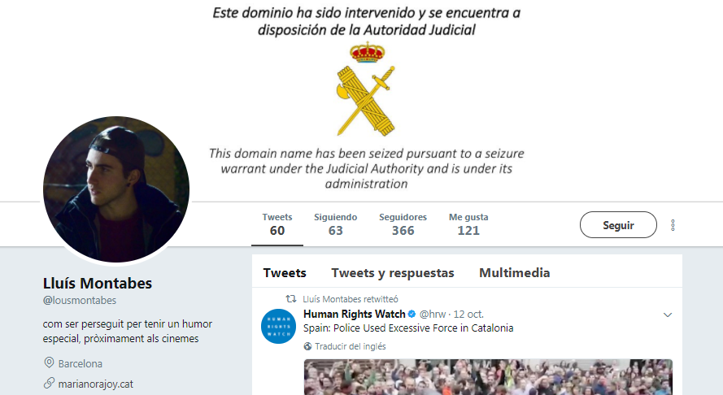
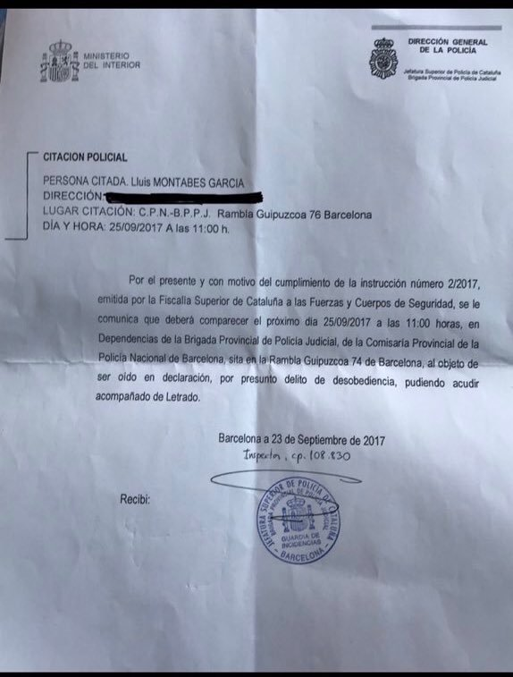
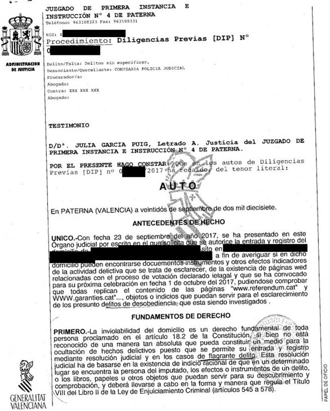
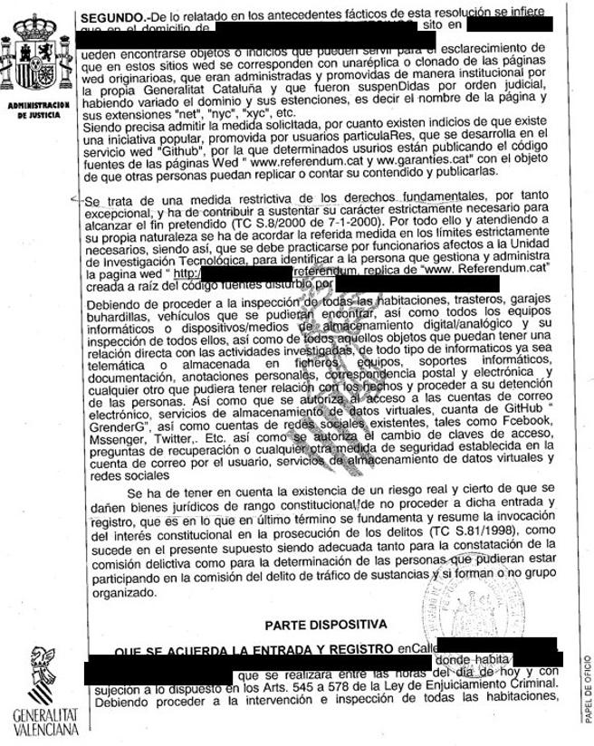
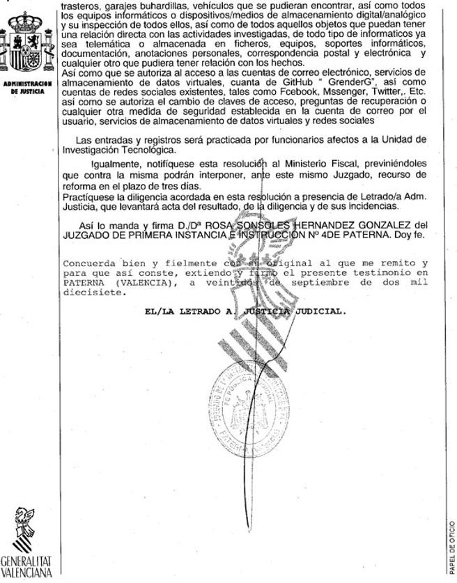
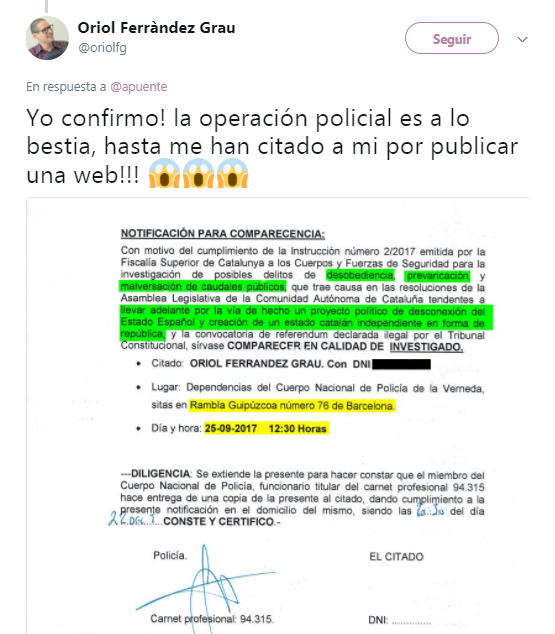
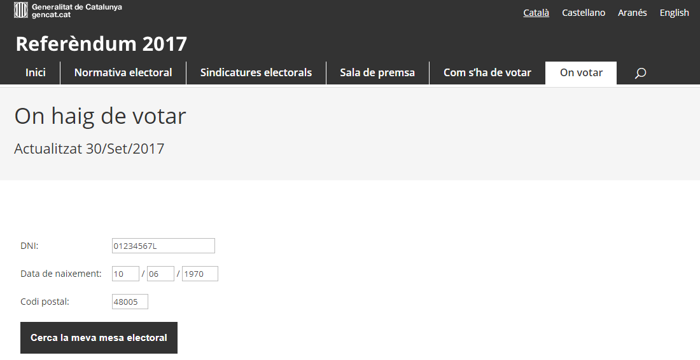

[volver](./)

* [Efecto Streisand: Hactivistas y movimientos sociales]()
* [Buscando mirrors](#buscando-mirrors)
* [Enlaces externos](#enlaces-externos).

# Efecto Streisand: Hactivistas y movimientos sociales

El **[efecto Streisand](https://es.wikipedia.org/wiki/Efecto_Streisand)** es un fenómeno de Internet en el que un **intento de censura o encubrimiento de cierta información fracasa o es contraproducente**, ya que esta acaba siendo ampliamente divulgada o reconocida. De modo que recibe mayor visibilidad de la que habría tenido si no se la hubiese pretendido acallar (El término debe su nombre a un incidente ocurrido en 2003 con la actriz estadounidense Barbra Streisand, que denunció al fotógrafo Kenneth Adelman y su página de fotografías).

**Lluis Montabés** ([@lousmontabes](https://twitter.com/lousmontabes)), estudiante de Barcelona de 19 años. **Acusado de desobediencia por crear marianmorajoy.cat para replicar las webs onvotar.garantiespelreferendum.com (offline), ref1oct.cat (bloqueado e intervenido judicialmente) y ref1oct.eu**. Fue uno de los cientos de espejos, o mirrors, habilitados casi al instante por una multitud de personas tanto dentro como fuera de Cataluña. 

Imagen de la citación por presunto delito de desobediencia:

La policía nacional registra una vivienda en Burjassot, en el área metropolitana de València, en la que presuntamente reside un "hacker" que estaría colaborando de manera altruista en la convocatoria de la votación.

Su nombre responde a Daniel Morales ([@GrenderG](https://twitter.com/GrenderG))  

Auto que autoriza el registro domiciliario del joven de Burjassot al que acusan de delito de desobediencia (Vía [@censura1oct](https://twitter.com/censura1oct)):

Morales explica que descargó el código fuente de las páginas web cerradas y lo alojó en la **[plataforma GitHub](https://github.com/grenderg)** para la compartirlo y hacerlo público para que todo el mundo pudiese replicar las páginas web. Es lo que se conoce como “mirror”, las webs que albergan el mismo contenido que otras, como si fueran “clones”.

> “Cuando la policía vino a mi casa estaba descargando las bases de datos que contienen información sobre los colegios electorales. El ordenador estaba encendido y en una pantalla tenía el script que hice para descargarlas y en la otra las propias bases de datos descargándose”

El dump ha sido creado con la herramienta [wget](https://www.gnu.org/software/wget/) y los links convertidos automáticamente.

Algunas informaciones relacionaban a Morales con la página [howtoprotectmyserver.com](http://howtoprotectmyserver.com/), que publica contenidos sobre 'hacking' ético.

Otro de los citados es **Oriol Ferràndez Grau** ([@oriolfg](https://twitter.com/oriolfg)). Se le acusa de crear la Web [Votemperserlliures.cat](https://votemperserlliures.cat/).
 

# Buscando mirrors

Jordi Murgó ([@jordimurgo](https://twitter.com/jordimurgo)) ([GitHub jordimurgo](https://github.com/jordimurgo)) mantiene en su cuenta de GitHub un espejo de la Web original totalmente funcional, tanto que permite consultar el centro de votación introduciendo el DNI la fecha de nacimiento y el Código Postal. El diseño de la web del referendum es francamente ingenioso, la única forma de que la Web sea tan portable que permita crear nuevas réplicas en pocos minutos es porque **la base de datos de los centros electorales y la población esta incrustada con la Web en vez de usar un sistema de gestión de base de datos externo**. 
	  

# Enlaces externos

* [“El creador de la web MarianoRajoy.cat se niega a declarar”](http://www.lavanguardia.com/politica/20170925/431557550642/marianorajoycat-lluis-montabes-declarar-web-referendum.html) ( lavanguardia.com - 25/09/2017).
* [“El creador de la web de l'1-O www.marianorajoy.cat, citat a declarar per desobediència”](http://www.ara.cat/politica/creador-marianorajoycat-citat-declarar-desobediencia_0_1875412620.html) (ara.cat - 24/09/2017)
* [“Declaran en comisaría una quincena de creadores de webs del 1-O: "Es un ataque a la libertad de expresión y de internet”](http://www.eldiario.es/catalunya/Declaran-comisaria-creadores-libertad-expresion_0_690481113.html) (eldiario.es - 25/09/2017)
* [“El universitario que creó la web marianorajoy.cat, citado a declarar”](http://www.elnacional.cat/es/politica/creador-web-marianorajoycat-referendum_194862_102.html) (elnacional.cat - 24/09/2017) 
* [“En libertad una decena de personas acusadas de crear réplicas de las webs sobre el 1-O”](http://www.publico.es/espana/libertad-decena-personas-acusadas-crear.html) (publico.es - 25/09/2017)
* ["¿Ruso? ¡Yo soy de Burjassot! El 'ejército' de informáticos que clona la web del 1-O"](https://www.elconfidencial.com/tecnologia/2017-09-28/rederendum-cataluna-hackers-webs-rusia_1451339/).
* ["Referendum 1-O: ¿Dónde votar?"](http://www.entredevyops.es/posts/referendum-votar.html) (entredevyops - 22/09/2017): Por Daniel Aresté análisis técnico que no puede ser más de actualidad: la web de consulta del censo para el referendum del 1-O.
* ["La policía registra el domicilio de un hacker en València vinculado al referéndum de Catalunya"](http://www.eldiario.es/cv/Registran-domicilio-Valencia-referendum-Catalunya_0_689431960.html) (eldiario - 22/09/2017).
* ["Civil Guard Shuts Down Catalan Government's Secret Electronic Voting Plan For Sunday Referendum"](https://www.thespainreport.com/articles/1168-170930162411-civil-guard-shuts-down-catalan-government-s-secret-electronic-voting-plan-for-sunday-referendum).

**Herramientas y aplicaciones:**

* [Is It Down Right Now](http://www.isitdownrightnow.com/): monitors the status of your favorite web sites and checks whether they are down or not.
* **GitHub** [jordimurgo/votarem](https://github.com/jordimurgo/votarem): Copia mirall d'aquella web que de tant en tant ens anuncia el President (amb la BD de col·legis electorals).
