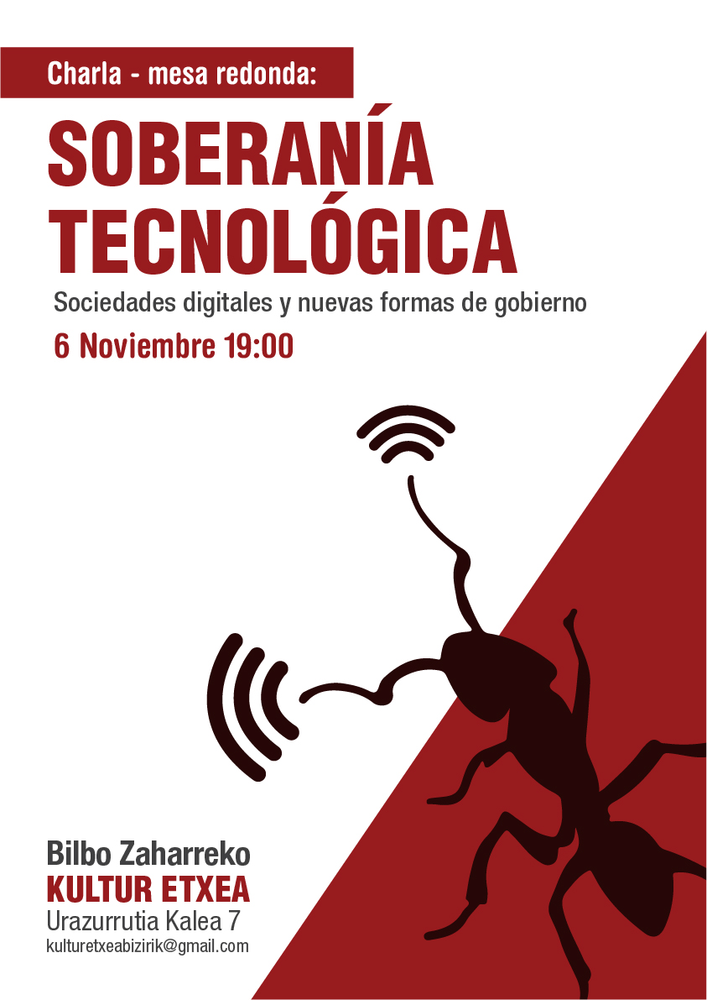
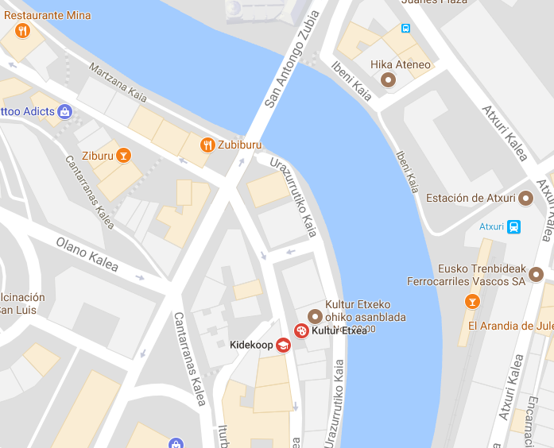

> "Las sociedades avanzan, en muchas ocasiones, a base de desobediencias”,

# Contenido

* [Cartel](#cartel).
* [Programa](#programa). 
* [Datos contacto y lugar](#datos-de-contacto-y-lugar).
* [Participantes](#participantes).
* [Presentaciones](#presentaciones).
* [Fotos de la charla](#fotos-de-la-charla).
* [Entradas](#entradas).
* [Entradas en desarrollo](#entradas-en-desarrollo).
* [Recursos](#recursos).

# Cartel 

[Volver a inicio](#contenido)

# Programa

[Volver a inicio](#contenido)

* [Invitación para difusión](https://pad.riseup.net/p/7u2sGwVrIMBj)
* [Programa](https://pad.riseup.net/p/Ejp2aGavFf2r)
	* [Testimonios](https://pad.riseup.net/p/RiaR0lkHcQ7D)

# Datos de contacto y lugar

[Volver a inicio](#contenido)

La charla se celebrará el Lunes 06 de Noviembre a las 19:00 horas en la Kultur Etxea de Bilbao La Vieja (C/ Urazurrutia 7).

* Correo electrónico: [ikastaroak.kulturetxea@gmail.com](mailto:ikastaroak.kulturetxea@gmail.com).
* Correo electrónico alternativo: [kulturetxeabizirik@gmail.com](mailto:kulturetxeabizirik@gmail.com)
* [Grupo trabajo en Facebook](https://www.facebook.com/groups/132160057442036/).
* [Evento en Facebook](https://www.facebook.com/events/132467557408123/132573560730856/).
* Canal en Telegram [@EHiria](https://t.me/EHiria).

Mapa ([enlace a mapa](https://www.google.es/maps/search/bilbo+zaharreko+kultur+etxea/@43.2548816,-2.921894,16z)):

# Fotos de la charla

Agunas fotos de la charla tomadas por Klaus en este [enlace](fotos_charla.md).

# Participantes

[Volver a inicio](#contenido)

Hemos creado una página especial para desarrollar la información en este [enlace](participantes.md).

# Presentaciones

* Julen Orbegozo: "[Redes sociales, internet (y política)](presentacion_julen_orbegozo.md)".        
 
# Entradas

[Volver a inicio](#contenido)

## Sociedad civil frente a la censura

* [Bloqueos DNS y censura en la red](bloqueos-dns-y-censura-en-la-red.md).
* [Buscando evidencias de la censura](evidencias-censura.md).
* [Efecto Streisand: Hactivistas y movimientos sociales](efecto-streisand-hactivistas-y-movimientos-sociales.md).
* [“Influencers”, intervenciones de ámbito internacional](influencers-intervenciones-de-ambito-internacional.md)

## Entradas en desarrollo

[Volver a inicio](#contenido)

Vamos a usar el servicio Etherpad alojado por Riseup.

* [La tecnología de las criptodivisas en la administración pública](https://pad.riseup.net/p/12tI9KXFqTDL).
* [Tecnopolítica para dummies](https://pad.riseup.net/p/LDHjsEEEsuOe).
* [Internet descentralizada y distribuida](https://pad.riseup.net/p/xWUuDbsRymmz)
* [OpenData: Cuando los gobiernos comparten](https://pad.riseup.net/p/DnG7qL6X3J9L)
* [Kit de Activismo Digital](https://pad.riseup.net/p/TzuH7jfwfN3j)

# Recursos

[Volver a inicio](#contenido)

## Audio

* ["Sin acritud: Soberanía tecnológica en la Kultur etxea"](https://97irratia.info/es/2017/10/27/soberania-tecnologica-la-kultur-etxea/): Pequeña entrevista donde la gente amiga de la radio "97 Irratia" ([descarga mp3](audio/20171027sinacritud.mp3))

## Libros

* [Referencias Bibliográficas](referencias_bibliograficas.md)