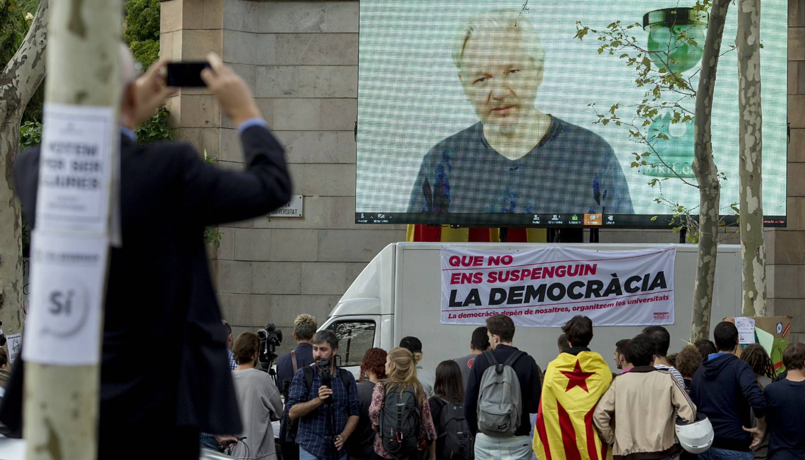
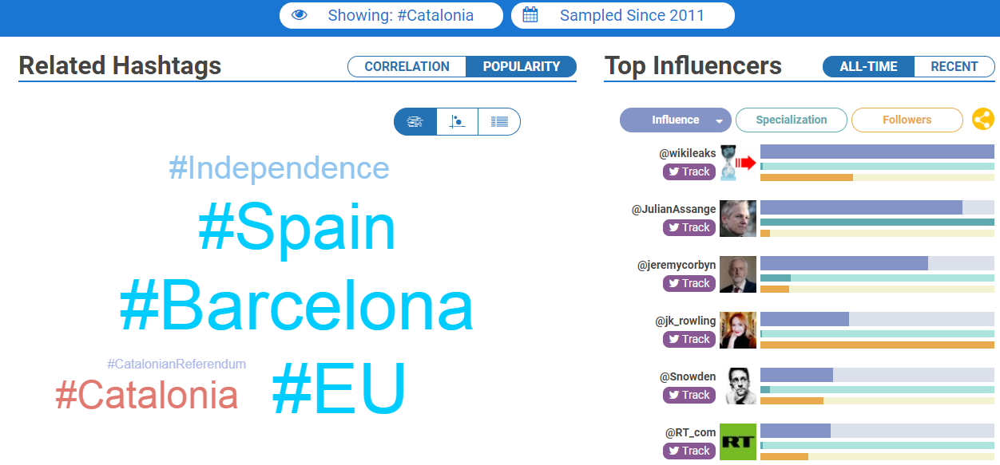

[volver](./)

El 26 de Septiembre Martes aparece en escena [Julian Assange](https://es.wikipedia.org/wiki/Julian_Assange) realizando una videoconferencia en una pantalla gigante en plena calle de Barcelona. La conferencia de Assange en Barcelona fue organizada por Universidades por la República (UxR). 

")

Pinchar sobre la imagen para ver parte de la videoconferencia.

El fundador de Wikileaks, Julian Assange junto con Eduard Snowden encabezan a lista de tuiteros más influyentes.

La Web [Hashtagify](http://hashtagify.me/) mide la influencia de un hashtag de Twitter.

# Enlaces externos

## Artículos 

* ["Assange alienta que la rebelión en Cataluña se extienda a nivel global”](https://elpais.com/ccaa/2017/09/26/catalunya/1506456387_836185.html) (elpais). 
* [“Assange y Snowden, entre los tuiteros más influyentes sobre referéndum catalán”](https://www.elconfidencial.com/espana/cataluna/2017-09-27/assange-y-snowden-entre-los-tuiteros-mas-influyentes-sobre-referendo-catalan_1451001/).
* ["Assange arenga a las masas en directo en Barcelona y compara España con China"](https://www.elconfidencial.com/espana/cataluna/2017-09-26/referendum-cataluna-julian-assange-defiende-independencia-barcelona_1450288/).

## Plataformas y movimientos

* [XNET](https://xnet-x.net/): proyecto activista que trabaja en diferentes campos relacionados con los derechos digitales y la democracia en red: libertad de expresión; neutralidad de la red; privacidad; la libre circulación de la cultura, el conocimiento y la información; mecanismos de transparencia, participación y control ciudadano del poder y las instituciones; la defensa del periodismo ciudadano por el derecho a saber, informar y estar informados; la lucha legal, técnica y comunicativa contra la corrupción; y la tecnopolítica entendida como la práctica y la acción en Red para el empoderamiento ciudadano, la justicia y la transformación social. 

## Aplicaciones

* [Hashtagify](http://hashtagify.me/) mide la influencia de un hashtag de Twitter.

[volver](./)