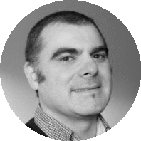
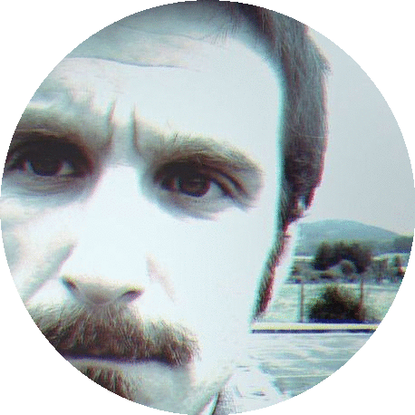
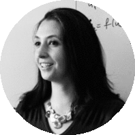
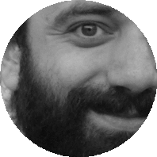
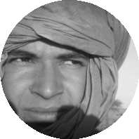

[volver](./)

# Participantes

Listado de participantes:

* [Asier Amezaga Albizu](#asier-amezaga-albizu).
* [Julen Orbegozo](#julen-orbegozo). 
* [heuristica.barcelona](#heuristica.barcelona): Luce y Emanuele.
* [Abdo Taleb Omar](abdo-taleb-omar).
* [Zirikatzen](#zirikatzen). Deustu herriko kolektiboa. 
* Bilbo Zaharreko [Kultur Etxea](#kultur-etxea).

# Asier Amezaga Albizu

[Volver a inicio](#participantes)

**Asier Amezaga** ([@asieramezaga ](https://twitter.com/asieramezaga)) trabaja como consultor de tecnologías sociales en [Komunikatik](http://www.komunikatik.com/) una empresa ubicada en Getxo, han trabajado en proyectos y en colaboración estrecha con empresas como: Koopera, 

# Julen Orbegozo

[Volver a inicio](#participantes)

**Julen Orbegozo** ([@julenor](https://twitter.com/julenor))

# heuristica.barcelona

[Volver a inicio](#participantes)

Somos un laboratorio de investigación colectiva. Un proyecto que se dedicará la promoción de una ciencia crítica y autocrítica y al análisis de datos para el bien común.

**Luce Prignano** es investigadora postdoctoral en la Universitat de Barcelona. Obtuvo su licenciatura en Física en la Universidad "Sapienza" de Roma y se doctoró en la Universidat de Barcelona con una tesis sobre la interdependencia de dinámica y topología en las redes complejas. Después del doctorado, fue investigadora en el "Institut Català de Paleoecologia Humana i Evolució Social" (IPHES) donde empezó a estudiar la redes de comunicación terrestre en época protohistórica. Ha sido curadora del blog de la “Cátedra de Ciencia y Humanismo” de la Universitat Rovira i Virgili "Antikythera - Útiles para la ciencia abierta".

**Emanuele Cozzo** ([@ecozzo](https://twitter.com/ecozzo)) es licenciado en física por la universidad "Sapienza" de Roma. Ahí también empieza su activismo político en el movimiento estudiantil y se forma su interés por la ciencia crítica, bebiendo de la tradición del departamento de física, conocido como la internacional de los científicos. Cursó su doctorado en teoría de redes y sistemas complejos en la Universidad de Zaragoza mezclando su formación académica con el activismo tecnopolítico en colectivos como datanalysis15m. Actualmente desarrolla su actividad investigadora en la Universitat de Barcelona.

# Abdo Taleb Omar

[Volver a inicio](#participantes)

# Zirikatzen

[Volver a inicio](#participantes)

# Kultur Etxea

[Volver a inicio](#participantes)