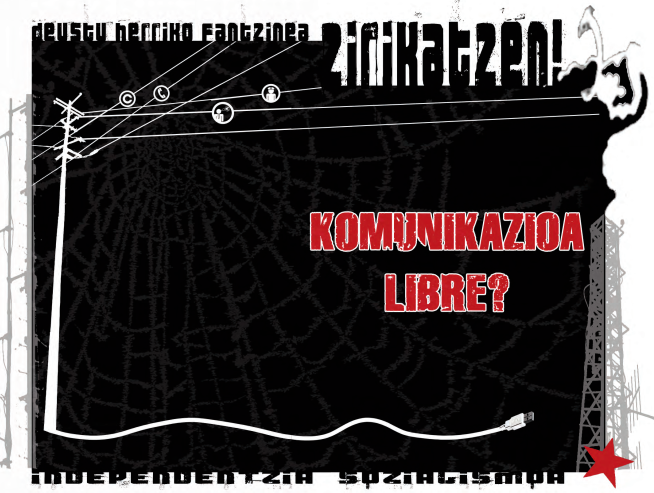
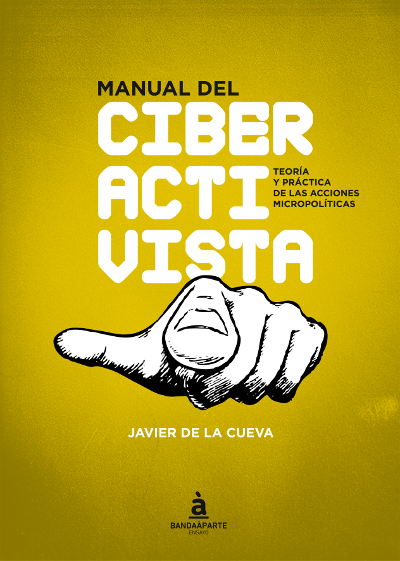

[volver](./)

**Contenidos**:

* [Zirikatzen. Sare sozialen inguruko txostena](#zirikatzen-sare-sozialen inguruko-txostena)
* [Manual del ciberactivista](#manual-del-ciberactivista)

# Zirikatzen. Sare sozialen inguruko txostena

[PDF](doc/ebooks/zirikatzen_sare_sozialak_txostena.pdf) 

# Manual del ciberactivista

**Manual del ciberactivista**. Teoría y práctica de las acciones micropolíticas.

* [Web oficial](http://manualdelciberactivista.org/). 
* [Descargar el Manual del Ciberactivista en formato pdf](http://manualdelciberactivista.org/documentos/2015-05-14_manual-del-ciberactivista_javier-de-la-cueva.pdf).
* [Referencias incluidas en el libro en PDF](http://manualdelciberactivista.org/archivos/2015-05-14_referencias_manualdelciberactivista.pdf).

**Javier de la Cueva** (Madrid, 1962) es licenciado en Derecho y doctor en Filosofía por la Universidad Complutense de Madrid. Trabaja como abogado y como docente. Como abogado, en sus manos ha estado la defensa de numerosos casos relacionados con la utilización de licencias de propiedad intelectual libre y de diferentes plataformas tecnológicas. 

El contenido de la obra se halla dividido en dos partes, una primera teórica y otra segunda práctica. En la primera parte se realiza una explicación analítica del ciberactivismo mientras que la segunda se centra en reflexiones sobre aspectos concretos que pudieran ser útiles para quien desee planificar alguna acción.

